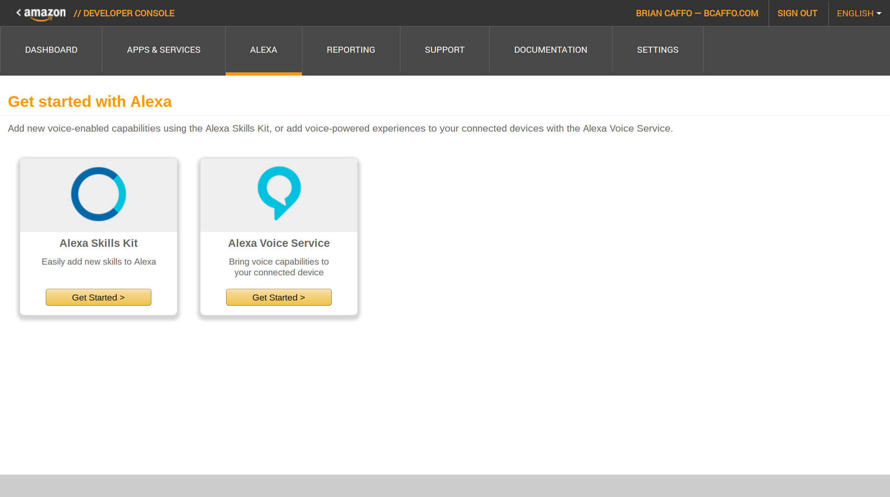
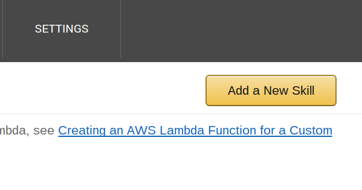
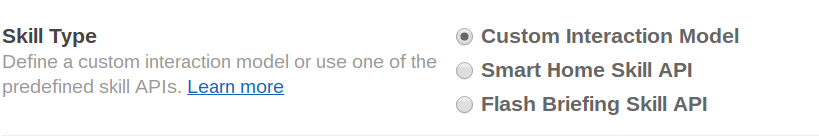
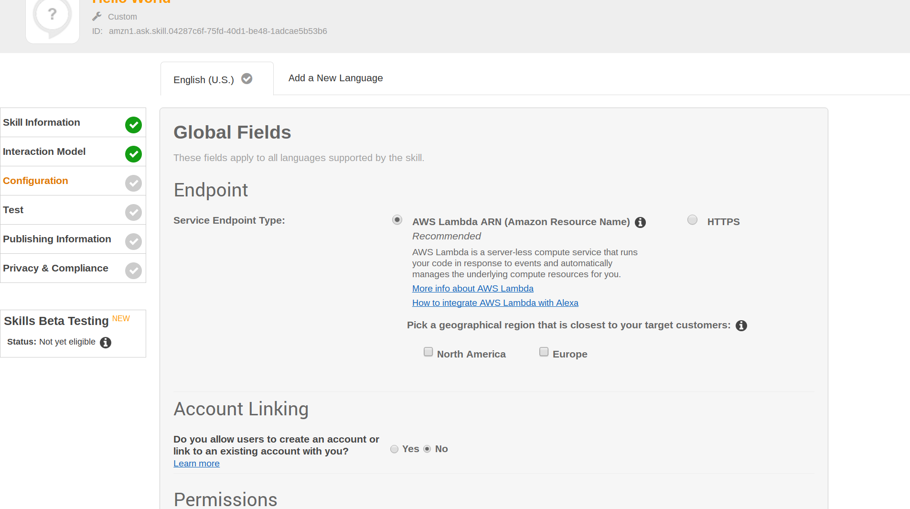
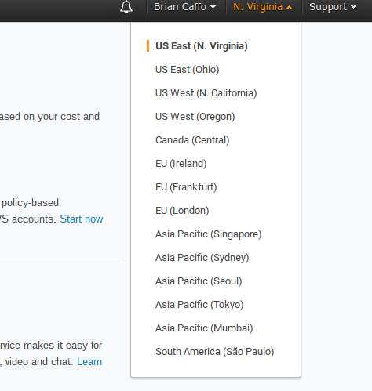
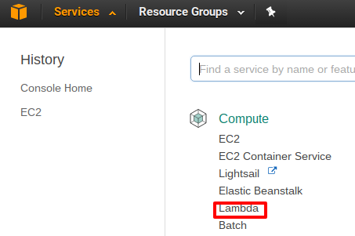
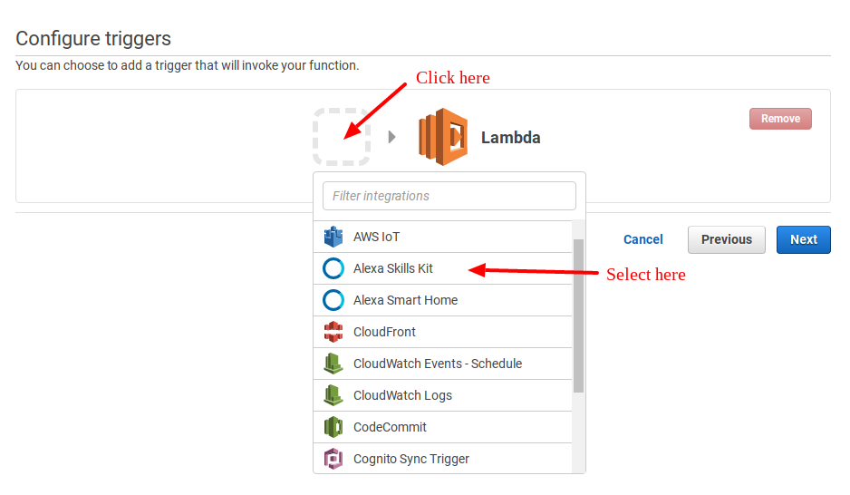
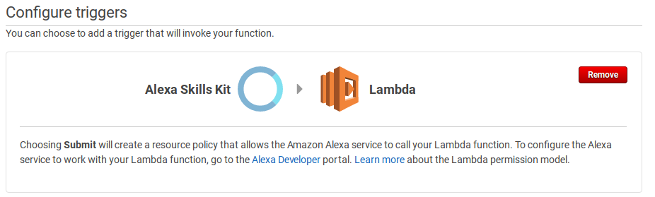

```{r setup, include=FALSE}
knitr::opts_chunk$set(echo = FALSE)
```

## Creating your first app
- In this lecture, you'll create your first app
- We'll be creating a *custom skill* using Amazon's
Alexa Voice Service and Lambda
- Make sure that you have an account on the Alexa Skills Developer Portal
- Since we'll be using the Lambda free tier, this won't
cost anything for development

## Hello world
- The first step will be to do Amazon's recommended "Hello World" app
- This uses node.js, but don't worry if you don't know it, we're just
going to be copy and pasting.
- Example developed by Diego Benitez
- The github repo for the example is at 

[https://github.com/alexa/skill-sample-nodejs-hello-world](https://github.com/alexa/skill-sample-nodejs-hello-world)

- You can clone the repo, or just copy and paste code from there

## Sign into the Amazon developer portal
- I often forget the url, google searching for "Alexa Skills Developer Console" it's the first hit
- [https://developer.amazon.com/home.html](https://developer.amazon.com/home.html)
- Make sure that you're signed in (upper right)
- Click on Alexa

## Click on "Alexa Skills Kit"

</img>

## Add a new skill

</img>

## Make sure "Custom Interaction Model" is checked

</img>

## Fill in the fields
- Name your app (say `Hello World`)
- Invocation name (say `Hello World`) again
  - Alexa will invoke the skill with "Alexa open Hello World"
- Audio player directives? No
- Click `Save` then `Next`

## The interaction model
- Amazon has launched a new interface called the "Skill Builder". Since this is still in beta, we'll do it using the existing interface. However, the Skill Builder is pretty cool, so give it a try on a next app.
- First we need to add some `intents`. From Amazon

*"An intent represents an action that fulfills a user’s spoken request. Intents can optionally have arguments called slots."*

- I think of intents as variable names for interactions with Alexa


## The intent schema from the repo

```
{
  "intents": [
    {
      "intent": "HelloWorldIntent"
    }
  ]
} 
```

## Sample utterances

- These are the things that people will say to invoke
the skill
- Try to include as many phrases as you can 
- Have to match your intent definitions (Amazon will give an error if not)

```
HelloWorldIntent hello
HelloWorldIntent say hello
HelloWorldIntent say hello world
HelloWorldIntent hello world
```

Click `Save` and then `Next`

## Check `AWS Lambda ARN (Amazon Resource Name)` 

</img>

You also have to pick a geographical region, my was `North America`
and then filled in with data from your lambda app, so we'll come
back to this

## Sign in to Amazon Web Services (AWS)
- Get an AWS account and sign in to the management console at [https://aws.amazon.com/](https://aws.amazon.com/)
- Make sure that you're using `US East (N. Virgina)` in the upper right dialog box

</img>

## Check on the `Lambda` link in `Services` (upper left)

</img>

## Click on `Create Lambda Function`

</img>

## Select `Blank Function`

The follow these instructions to get Alexa Skills Kit to trigger
the function

</img>


## It should look like this

</img>


## 

