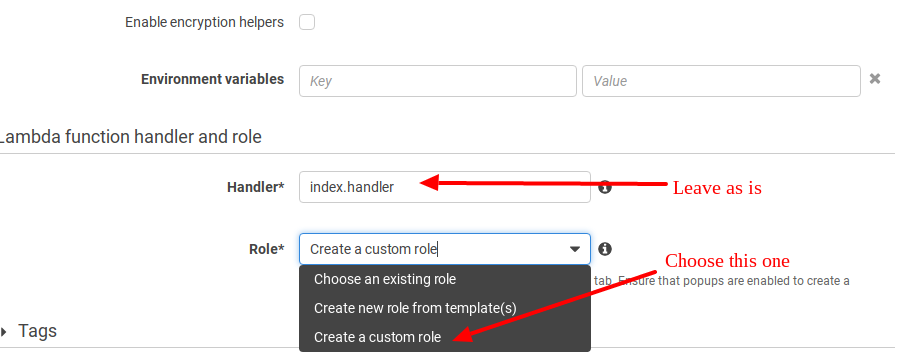
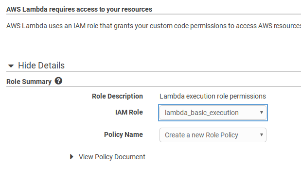
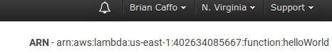
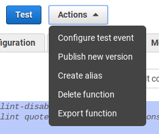
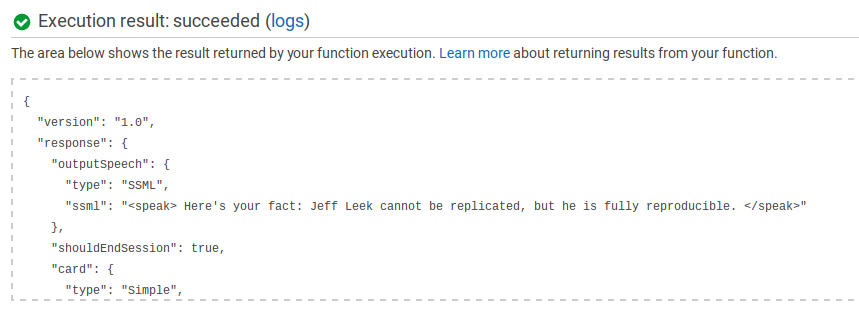

```{r setup, include=FALSE}
knitr::opts_chunk$set(echo = FALSE)
```

## Creating your first app
- In this lecture, you'll create your first app
- We'll be creating a *custom skill* using Amazon's
Alexa Voice Service and Lambda
- Make sure that you have an account on the Alexa Skills Developer Portal
- Since we'll be using the Lambda free tier, this won't
cost anything for development

## Hello world
- The first step will be to do Amazon's recommended "Hello World" app
- This uses node.js, but don't worry if you don't know it, we're just
going to be copy and pasting.
- Example developed by Diego Benitez
- The github repo for the example is at 

[https://github.com/alexa/skill-sample-nodejs-fact](https://github.com/alexa/skill-sample-nodejs-fact)

- You can clone the repo, or just copy and paste code from there
- There's great directions there

## Sign into the Amazon developer portal
- I often forget the url, google searching for "Alexa Skills Developer Console" it's the first hit
- [https://developer.amazon.com/home.html](https://developer.amazon.com/home.html)
- Make sure that you're signed in (upper right)
- Click on Alexa

## Click on "Alexa Skills Kit"

</img>

## Add a new skill

</img>

## Make sure "Custom Interaction Model" is checked

</img>

## Fill in the fields
- Name your app (say `Jeff Leek Facts`)
- Invocation name (say `Jeff Leek Facts`) again
  - Alexa will invoke the skill with "Alexa open Hello World"
- Audio player directives? No
- Click `Save` then `Next`

## The interaction model
- Amazon has launched a new interface called the "Skill Builder". Since this is still in beta, we'll do it using the existing interface. However, the Skill Builder is pretty cool, so give it a try on a next app.
- First we need to add some `intents`. From Amazon

*"An intent represents an action that fulfills a user’s spoken request. Intents can optionally have arguments called slots."*

- I think of intents as variable names for interactions with Alexa


## The intent schema from the repo

```
{
  "intents": [
    {
      "intent": "GetNewFactIntent"
    },
    {
      "intent": "AMAZON.HelpIntent"
    },
    {
      "intent": "AMAZON.StopIntent"
    },
    {
      "intent": "AMAZON.CancelIntent"
    }
  ]
}
```

## Sample utterances

- These are the things that people will say to invoke
the skill
- Try to include as many phrases as you can 
- Have to match your intent definitions (Amazon will give an error if not)

```
GetNewFactIntent a fact
GetNewFactIntent a Jeff fact
GetNewFactIntent tell me a Jeff fact
GetNewFactIntent tell me a Jeff fact
GetNewFactIntent give me a fact
GetNewFactIntent give me a Jeff fact
GetNewFactIntent tell me Jeff Leek fact
```

Click `Save` and then `Next`

## Check `AWS Lambda ARN (Amazon Resource Name)` 

</img>

You also have to pick a geographical region, my was `North America`
and then filled in with data from your lambda app, so we'll come
back to this

## Sign in to Amazon Web Services (AWS)
- Get an AWS account and sign in to the management console at [https://aws.amazon.com/](https://aws.amazon.com/)
- Make sure that you're using `US East (N. Virgina)` in the upper right dialog box

</img>

## Check on the `Lambda` link in `Services` (upper left)

</img>

## Click on `Create Lambda Function`

</img>

## Select `Blank Function`

The follow these instructions to get Alexa Skills Kit to trigger
the function

</img>


## It should look like this

</img>

## On the code entry type, choose 
- Fill in a name and desciption
- Leave the runtime as `Node.js 4.3`
- `Code Entry Type` as `Edit code inline`
- Paste in all of the code from the github repo into the text box
[https://github.com/bcaffo/alexaai/blob/master/lectures/02_your_first_app/jeffLeekFactsLambdaCode.js](https://github.com/bcaffo/alexaai/blob/master/lectures/02_your_first_app/jeffLeekFactsLambdaCode.js)


## Scroll down
- There's more. Keep your environment variables blank
- Keep your `Handler` as `index.handler`
- `Role*` as `Create custom role`

</img>


## Use the auto-populated values on this page and click `Allow`
Leave `Tags` and `Advanced` as is and click next

</img>

## Click `Create Function`

</img>


## Get your `ARN` number (upper right) 

</img>

## Paste it into your `Endpoint` 
Not in AWS, in the Alexa Skills Kit Developer Console

</img>

## Now you can test your skill

</img>

## You can also test your skill on lambda to debug there
- Copy your Lambda request from your Alexa Developer Console test
page for your app
- Paste it into your `Configure test event` 
- Click on `Test`

</img>

## See the result and log files below on the same page

</img>


