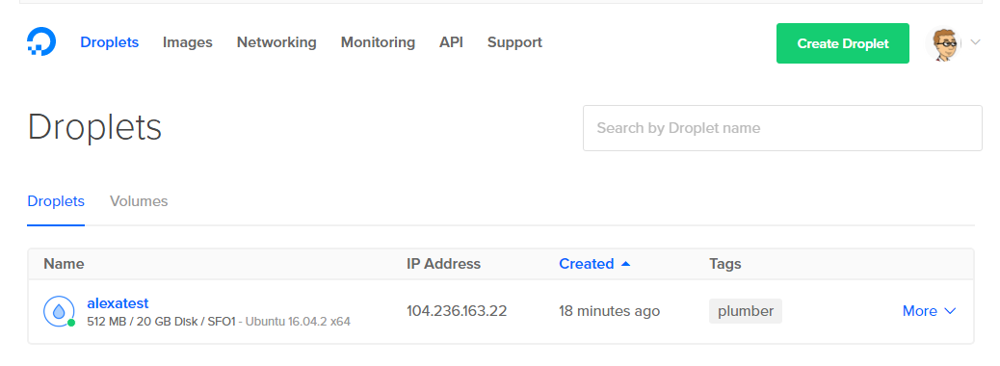

```{r setup, include=FALSE}
knitr::opts_chunk$set(echo = FALSE)
```

## Summary

- We've created an Alexa app using lambda, Amazon's on demand serverless hosting service
- Now we'd like to try running our own server, and we're going to use R to do it!
- Set up on the Alexa skills kit will be similar; set up on the server will
be a little different

## General overview
- In broad strokes we need
  1. A server that takes input in the correct format over secure http (https) and sends it back in the correct format (adhering to Alexa's json requirements)
  2. Getting a domain name for that server
  3. Setting up our app using the Alexa skills kit
- Each of these steps will be a bit involved, so we'll go through them in detail

## Assumptions
- We're going to assume that you're working from a unix/linux machine
- If you're using a cloud instance of Rstudio as your linux machine, 
it's a bad idea to run your alexa server on it, spool of a new digital ocean droplet
- So, we'll assume that you have a unix/linux version of R running and that
you can access a terminal and R session on that machine

## Setting up your alexa server
- Luckily we have great work on `plumber`, `analogsea` and `alexar` to help us out
- We'll set up our server on DigitalOcean, this is a particularly nice 
cloud platform for running servers so that you don't have to have hardware yourself
  - Other options include: Amazon's EC2 or Google and Microsoft's cloud platforms
  - Or you could run your own with that old laptop that's not doing anything
- Our solution is definitely the easiest for this class
- Step one is to set up and account on DigitalOcean

## Set up ssh keys
- It's necessary to set up ssh keys
- Click on your icon on DigitalOcean (upper right) then "settings" the on the left "security"
- Click on "add ssh key"
- paste your public key file and name it then select save
- Information on how to generate public keys can be found [here](https://www.digitalocean.com/community/tutorials/how-to-use-ssh-keys-with-digitalocean-droplets)
- I had to generate a new key to get this to work, I think it was the specific encryption
of my old keys

## Verify 
- Verify that you can create a server and log into it using your ssh key
- This will save you some trouble of getting everything to work in R
- In windows use gitbash to check
- In OSX or Linux use the terminal to check

## Authentication
- Get an authentication token from DigitalOcean [https://cloud.digitalocean.com/settings/tokens/new](https://cloud.digitalocean.com/settings/tokens/new)
- Assign the token to an environment variable called DO_PAT
```
export DO_PAT=TOKEN NUMBER FROM DIGITALOCEAN
```
Add this line to your `.bashrc` file if you'd like


## Install development versions of analogsea and plumber
- Start an R session, make sure that you have `devtools` installed

```{r, eval = FALSE, echo = TRUE}
devtools::install_github("sckott/analogsea")
devtools::install_github("trestletech/plumber")
library(plumber)
```

## Spool up your server, using R!
- Start your server on DigitalOcean using plumber's command

```{r, eval = FALSE, echo = TRUE}
do_provision(unstable = TRUE, name = "alexatest")
```

- Should take a few minutes and create a lot of messages


## Droplet is up on DO



## Some notes
- Your server is now up and running (and charging you money), you can "destroy" the droplet on DigitalOcean when you're done with it.
- You can check on DigitalOcean to see the droplet there and look at graphs
- `do_provision` installed all of the software needed to run our server!
- Check your server by copying the ip address of the server and pasting
it into your browser, it should say "Plumber is alive!"

## Money saving tips on DO or EC2
- Turn off your servers when you aren't using them
- Create the smallest size server (you can resize it later if needed); our 
script uses default the smallest server and tricks like ramdrive to get
away with it
- Destroy / terminate the server when you're done using it

## Using EC2 instead of DO
- I'm working on a shell script that does all of the stuff that do_provision does
  so that you can do it on any linux server
- The script can be found here [here](https://github.com/bcaffo/alexaai/blob/master/lectures/03_using_plumber/install.sh)

