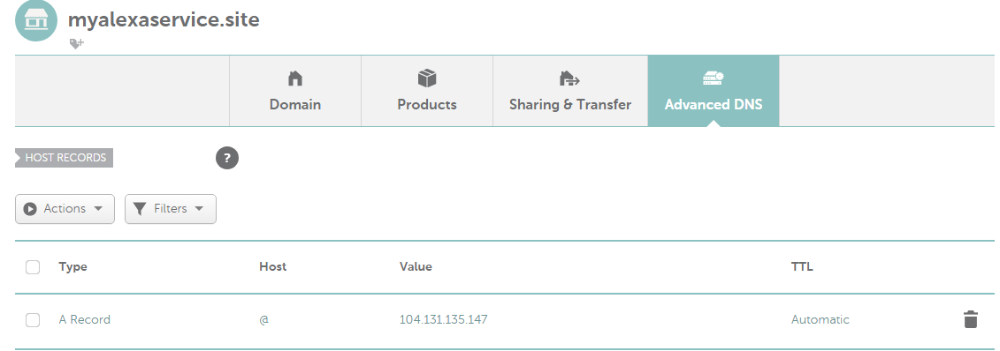
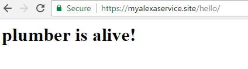

```{r setup, include=FALSE}
knitr::opts_chunk$set(echo = TRUE, eval = FALSE)
```

## Registering a domain
- Echo development requires `https`, encrypted communication between our alexa server and web server, to function
- To use `https` we need a domain
- Purchase a domain on one of the sites
  - I used `namecheap`, but some others include `name.com`, `godaddy` etc; shop around
  for the one you like best
  - Type in a domain that you might want and shop around for a good value

## Steps when I did it on namecheap
- I bought the domain `myalexaservice.site` for $0.88 / year
- I verified the site over email
- I clicked on `Domain List` then `Advanced DNS`
- I deleted all records and added an `A record` that points to the ip address
of my server with host `@`
- (Wait several minutes for the change to take effect)
- Test it out by going to your domain `myalexaserice.site` and it should
show `Plumber is alive!` from our previous lecture

## 



## Get the list of droplets from DO
```{r}
## list out your droplets
analogsea::droplets()
## assign the one you want to a variable
myDroplet = analogsea::droplets()$alexatest
```


## Use `letsencrypt`
- You could buy SSL (encrypted web communication) from your domain registrar
- `letsencrypt` is a free service for doing this; [you can donate here](https://letsencrypt.org/donate)
- `plumber` has a command for setting things up from R
```{r}
do_configure_https(myDroplet, 
                   "myalexaservice.site", 
                   "myemail@gmail.com", 
                   TRUE)
```
- `myDroplet` is your droplet
- `"myalexaservice.site"` is my registered domain
- `"myemail@gmail.com"` is your email
- `TRUE` is for accepting `letsencrypt`'s [terms of service](https://community.letsencrypt.org/tos)

## Output

```
IMPORTANT NOTES:
 - Congratulations! Your certificate and chain have been saved at
   /etc/letsencrypt/live/myalexaservice.site/fullchain.pem. Your cert
   will expire on 2017-09-13. To obtain a new or tweaked version of
   this certificate in the future, simply run certbot again. To
   non-interactively renew *all* of your certificates, run "certbot
   renew"
 - Your account credentials have been saved in your Certbot
   configuration directory at /etc/letsencrypt. You should make a
   secure backup of this folder now. This configuration directory will
   also contain certificates and private keys obtained by Certbot so
   making regular backups of this folder is ideal.
 - If you like Certbot, please consider supporting our work by:

   Donating to ISRG / Let's Encrypt:   https://letsencrypt.org/donate
   Donating to EFF:                    https://eff.org/donate-le
```

## Check your site




## Note
- If you restart your server, you may get assigned a different IP
- So, remember to change your record at your hosting site to the new IP address
